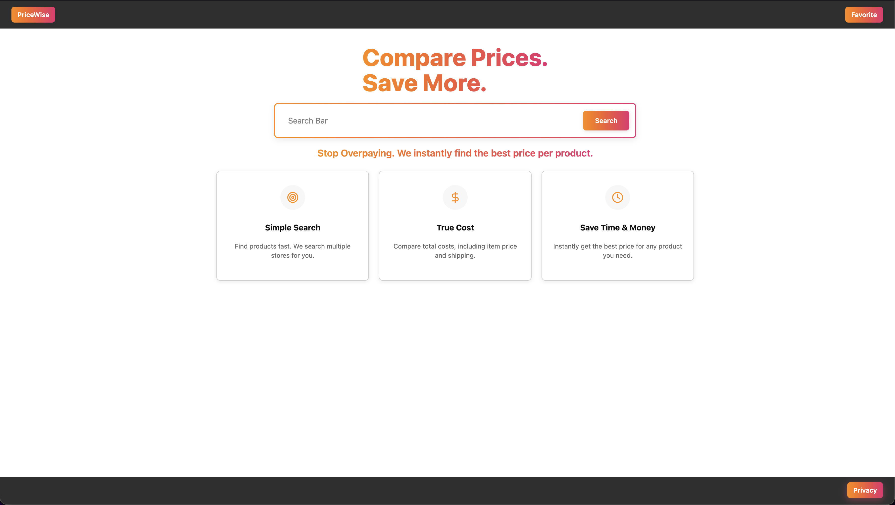

# PriceWise

_A price comparison tool leveraging Google search API_

---

## Table of Contents

- [About the Project](#about-the-project)
- [Tech Stack](#tech-stack)
- [Features](#features)
- [Project Structure](#project-structure)
- [Getting Started](#getting-started)
  - [Backend Setup (Django)](#backend-setup-django)
  - [Frontend Setup (React)](#frontend-setup-react)
- [API Documentation](#api-documentation)
- [Screenshots](#screenshots)

---

## About the Project

Provide a brief explanation of the project. Example:

> This project is a full-stack web application built with Django (REST API) and React (frontend).
> Which serves google API data to a react frontend and uses it to implement a cost comparison tool.

---

## Tech Stack

### **Frontend**

- React

### **Backend**

- Python 3.x
- Django
- Django REST Framework
- PostgreSQL (Production) / SQLite (Development)

## Features

- Modern React UI
- REST API with DRF
- SERPAPI querying

---

## Project Structure

```
.
├── backend
│   ├── api
│   │   ├── __init__.py
│   │   ├── admin.py
│   │   ├── apps.py
│   │   ├── data_structures
│   │   │   ├── __init__.py
│   │   │   ├── pricematchtrie.py
│   │   │   ├── trie.py
│   │   │   └── union.py
│   │   ├── migrations
│   │   │   ├── __init__.py
│   │   │   └── 0001_initial.py
│   │   ├── models.py
│   │   ├── search_engine.py
│   │   ├── seed.py
│   │   ├── tests.py
│   │   ├── urls.py
│   │   └── views.py
│   ├── backend
│   │   ├── __init__.py
│   │   ├── asgi.py
│   │   ├── settings.py
│   │   ├── urls.py
│   │   └── wsgi.py
│   ├── guide.md
│   ├── manage.py
│   └── package-lock.json
├── demo_video
│   └── guide.md
├── figma_wireframe
│   ├── guide.md
│   ├── Markup_Doc
│   ├── Markup_Document.txt
│   ├── Screenshot 2025-10-22 at 11.44.13 PM.png
│   └── Screenshot 2025-10-22 at 11.44.33 PM.png
├── frontend
│   ├── build
│   │   ├── asset-manifest.json
│   │   └── index.html
│   ├── guide.md
│   ├── package-lock.json
│   ├── package.json
│   ├── public
│   │   └── index.html
│   └── src
│       ├── App.js
│       ├── Components
│       │   ├── AboutPage.jsx
│       │   ├── App.jsx
│       │   ├── FavoritePage.jsx
│       │   ├── PrivacyPage.jsx
│       │   ├── ResultsPage.jsx
│       │   └── SearchPage.jsx
│       ├── Data
│       │   └── mockProducts.js
│       ├── index.js
│       └── utils
│           └── favorites.js
├── README.md
├── README.md.bak
├── requirements.txt
└── weekly_notes
    ├── week10.md
    ├── week11.md
    ├── week12.md
    ├── week13.md
    ├── week14.md
    ├── week15.md
    ├── week16.md
    ├── week5.md
    ├── week6.md
    ├── week7.md
    ├── week8.md
    └── week9.md
```

## Getting Started

> ### Backend Setup (Django)

```
# API #
Request an API key from SERPAPI found here: https://serpapi.com/users/sign_up
Edit the .env.example file as instructed in the file pasting your API key and renaming
the file

git clone git@github.com:jlaua2/CS351--Group-12.git
python3 -m venv venv
source venv/bin/activate
pip install -r requirements.txt
python3 backend/manage.py makemigrations
python3 backend/manage.py migrate

#Initial seed procedure
python3 backend/manage.py shell
>>> from api.seed import run
>>> run()
```

> ### Frontend Setup (React)

```
cd frontend
npm install
npm run build
npm start
```

## API Documentation

- [SERPAPI Documentation](https://serpapi.com/search-engine-apis)

## Screenshots


